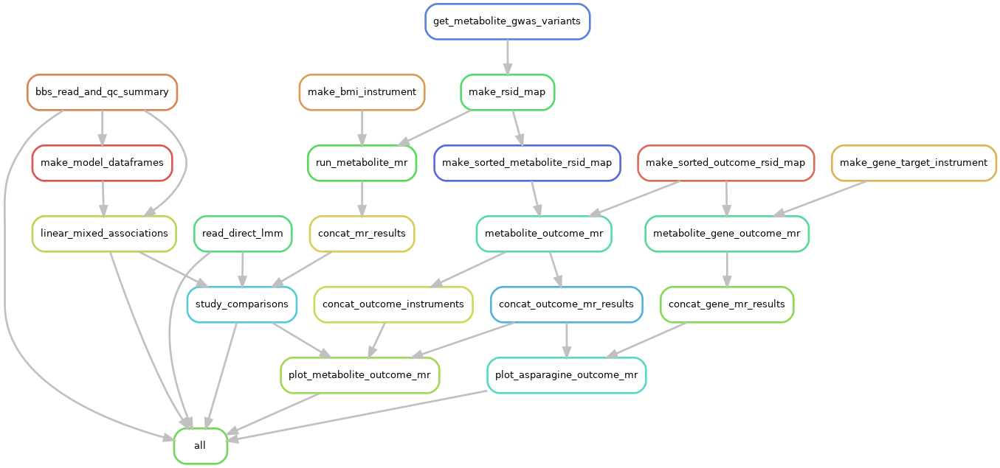

## Metabolomic signature of weight loss and association with heart failure
###### Project ID: wt1_wp1_036_bmi_hf_metabolomics
###### Contact: nicholas.sunderland@bristol.ac.uk

### Introduction
This repository contains a reproducible Snakemake workflow for setting up and executing the analyses behind the project “Metabolomic signature of weight loss and association with heart failure.”
The pipeline integrates metabolomic data from weight-loss interventions (DiRECT and By-Band-Sleeve trials) with Mendelian randomisation analyses to identify metabolic signatures of BMI change and evaluate their links to heart failure.

This README focuses on getting the computational environment ready, configuring the project, and running the workflow end-to-end so that results can be reproduced consistently across Mac, Linux, and Windows systems. Although it has only been tested on Mac. 

---

### TL;DR - Mac/Linux
To set up the conda environment and run the analyses:
``` 
  - python=3.11
RUN pip3 install snakemake==7.26
RUN pip3 install --force-reinstall pulp==2.7.0
  - graphviz=12.2.1
  - python-dotenv=1.1.0 in a conda environment snakemake

mamba install -c conda-forge python-dotenv


bash setup_env.sh
conda activate wt1_wp1_036_bmi_hf_metabolomics
snakemake --cores 1 --rerun-incomplete all
```

## Requirements
singularity 3.8.3  
snakemake 7.26 (i.e. not 8.x)
pulp 2.7.0 (i.e. <2.8)
Docker image: `docker://nicksunderland/hf_mvmr:latest`  
Data directory: `/user/home/xx20081/work/data`

## Making the conda env that has snakemake and also uses R
create a conda env
install snakemake version 7.26
install base r version 4.3.3
Then we need to change where R looks for library files to the conda env. 
https://intellij-support.jetbrains.com/hc/en-us/community/posts/360009755299-Pycharm-R-error-Cannot-run-console-RWrapper-terminated-exit-code-1
On the home HPC dir for your account go to and open:
```{bash}
nano ~/.local/share/JetBrains/PyCharm2023.3/r-plugin/R/GetEnvVars.R
```
Change line: 
```{r} 
else if (get_os() == "linux") Sys.getenv("LD_LIBRARY_PATH")
# to --> 
else if (get_os() == "linux") 
"/user/work/xx20081/miniforge3/envs/snakemake/lib:/user/work/xx20081/miniforge3/envs/snakemake/lib/R/lib" # Sys.getenv("LD_LIBRARY_PATH")
```

## Docker image
All the required software and packages have been installed into a docker image. The image specification is contained in the `Dockerfile` incase this needs to be rebuilt or adjusted.

## Run
The project can be run on the Bristol HPC. First, load singularity and snakemake. Snakemake 7.26 is installed in a conda environment that needs to be activated.

The project (slurm) configuration profile is contained within the `config.yaml` file. The snakemake `--profile` option takes a directory path to the where the `config.yaml` file can be found. In this case simply `.` as we have cd into the top level project directory.  

To run the project, submitting each job to the compute nodes, run the `all` rule like so:

```{bash}
module load apptainer
conda activate $WORK/miniforge3/envs/snakemake
cd $WORK/projects/bmi_metabolites_and_heart_failure
snakemake --profile . all -n
```

### TL;DR - Windows
``` 
powershell setup_env.ps1
conda activate wt1_wp1_036_bmi_hf_metabolomics
snakemake --cores 1 --rerun-incomplete all
```

---

### Installation
#### GitLab repository
First clone the GitHub repo:
```
git clone [TBC]
cd wt1_wp1_036_bmi_hf_metabolomics
```
### Automated install
#### Setup script
Environment setup is automated for both Unix-based systems and Windows using the `setup_env.(sh|ps1)` scripts to run the installation of conda (if required), create the conda environment from the `environment.yml` file and install R packages not available through conda channels (missing arm builds, non-CRAN Github repos etc.) using the `scripts/install_packages.R` script. 

##### Mac or Linux
Run the bash script in this repository `bash setup_env.sh`

#### Windows
Run the powershell script in this repository `powershell setup_env.ps1`


### Manual install
#### Conda
First make sure [Miniconda](https://www.anaconda.com/docs/getting-started/miniconda/install), [Anaconda](https://www.anaconda.com/docs/getting-started/anaconda/install), and/or Mamba are installed. Then to create the conda environment run:  
```{bash}
conda activate base
conda env create -f environment.yml
```

#### R packages
With the conda environment activated, run the R package installation script.
```{bash}
Rscript --vanilla scripts/install_packages.R
```

If all is successful you should be good to go.

---

### Environment variables (.env file)
Once you have your cloned repo, rename the `.env_example` file to `.env` and edit the environment variables. Here you need to specify the raw data files, unfortunately these are not publicly available, and you would need to either obtain permissions to use them (see data availability statement) or run this at Bristol with appropriate account permissions.

| Variable                    | Description                                                                                                                                               |
|-----------------------------|-----------------------------------------------------------------------------------------------------------------------------------------------------------|
| PROJECT_DIR                 | Working project directory on the Bristol RDSF (must contain `data/`, `results/`, `scripts/`).                                                             |
| BBS_CLINICAL                | By-Band-Sleeve clinical file (`03_sample_clinical_data_all_cols.csv`).                                                                                    |
| BBS_WITHDRAWAL              | BBS withdrawals file (`WoC_20230608`).                                                                                                                    |
| BBS_METABOLON_RDATA         | BBS Metabolon RData file (`ReportData.Rdata`).                                                                                                            |
| BBS_METABOLON_LOG           | BBS Metabolon log file (`bbs_only_2025_04_07_logfile.txt`).                                                                                               |
| BBS_METABOLON_MANIFEST      | BBS Metabolon manifest file (`2023Q2_nmr_annotated_manifest_2023-08-14.csv`) — dummy variable required for workflow.                                      |
| BBS_NIGHTINGALE_RDATA       | BBS Nightingale RData file (`ReportData.Rdata`).                                                                                                          |
| BBS_NIGHTINGALE_LOG         | BBS Nightingale log file (`bbs_primary_nmr_no_outliers_2025_06_05_logfile.txt`).                                                                          |
| BBS_NIGHTINGALE_MANIFEST    | BBS Nightingale manifest file (`2023Q2_nmr_annotated_manifest_2023-08-14.csv`).                                                                           |
| DIRECT_METABOLON            | DiRECT Metabolon mixed-model results, run on the Glasgow TRE (`linear_mixed_associations_rnt_direct_scaled_metabolon.tsv`).                               |
| DIRECT_INT_ONLY_METABOLON   | DiRECT Metabolon intervention-only results, run on the Glasgow TRE (`linear_mixed_associations_rnt_direct_scaled_intervention_only_metabolon.tsv`).       |
| DIRECT_NIGHTINGALE          | DiRECT Nightingale mixed-model results, run on the Glasgow TRE (`linear_mixed_associations_raw_z_direct_scaled_nightingale.tsv`).                         |
| DIRECT_INT_ONLY_NIGHTINGALE | DiRECT Nightingale intervention-only results, run on the Glasgow TRE (`linear_mixed_associations_raw_z_direct_scaled_intervention_only_nightingale.tsv`). |


### Running the analyses

This project uses a [Snakemake](https://snakemake.readthedocs.io/en/v7.32.0/getting_started/installation.html) pipeline to track analyses 
and ensure scripts and outputs are kept up-to-date. To reproduce the project end-to-end, first activate the conda environment and then run the Snakemake pipeline from this repo's root directory.

```
conda activate wt1_wp1_036_bmi_hf_metabolomics
snakemake --cores 1 --rerun-incomplete all
```

#### Workflow rule graph
This executes the following work flows:  



#### Steps
| Step | Purpose                                                                                                              | Key script(s)                             | Primary outputs                                                                      |
|------|----------------------------------------------------------------------------------------------------------------------|-------------------------------------------|--------------------------------------------------------------------------------------|
| 1    | Preprocess By-Band-Sleeve metabolomics (Metabolon, Nightingale), apply QC, and save cleaned objects plus QC reports. | `scripts/read_bbs_data_qc_summary.R`      | `.results/tables/qc/*.tsv`, `.results/tmp_objects/bbs_*.RDS`                         |
| 2    | Build model-ready data frames (raw, z-scored, rank-normalised) for each platform.                                    | `scripts/make_model_dataframe.R`          | `.results/tmp_objects/model_df_*_bbs_*.tsv`, log files                               |
| 3    | Run linear mixed association models for BBS data.                                                                    | `scripts/linear_mixed_associations_bbs.R` | `.results/tables/linear_mixed_associations/linear_mixed_associations_*_bbs_*.tsv`    |
| 4    | Import DiRECT linear mixed association results generated on the Glasgow TRE.                                         | `scripts/read_direct_data.R`              | `.results/tables/linear_mixed_associations/linear_mixed_associations_*_direct_*.tsv` |
| 5    | Compare BBS vs DiRECT associations and summarise replication.                                                        | `scripts/study_comparisons.R`             | `.results/tables/replication/*.tsv`, `.results/figures/replication/*.png`            |
| 6    | Plot Mendelian randomisation of BMI-associated metabolites on heart failure outcomes.                                | `scripts/metabolite_outcome_mr.R`         | `.results/tables/outcomes/*.tsv`, `.results/figures/outcomes/*.png`                  |


---
